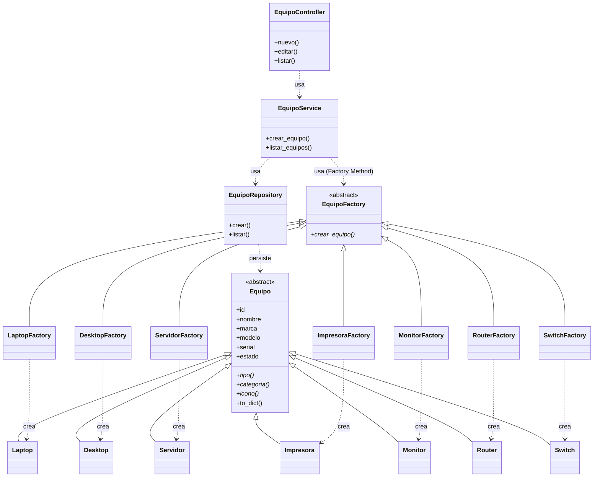

# Diagrama UML de Clases — Patrón Factory Method

El siguiente diagrama (Mermaid) evidencia el patrón Factory Method y su
relación con las capas Controller → Service → Repository.

## Lectura del diagrama

- **EquipoFactory** es el *Creator* abstracto y declara `crear_equipo()`.
- Cada **fábrica concreta** (LaptopFactory, RouterFactory, …) implementa
  `crear_equipo()` y produce su **producto** concreto correspondiente.
- **EquipoController** nunca instancia un `Equipo`: llama a **EquipoService**.
- **EquipoService** selecciona la fábrica (vía el registro `FABRICAS`) y delega
  la creación. Así la lógica queda desacoplada.
- **EquipoRepository** solo persiste/lee en SQLite.
